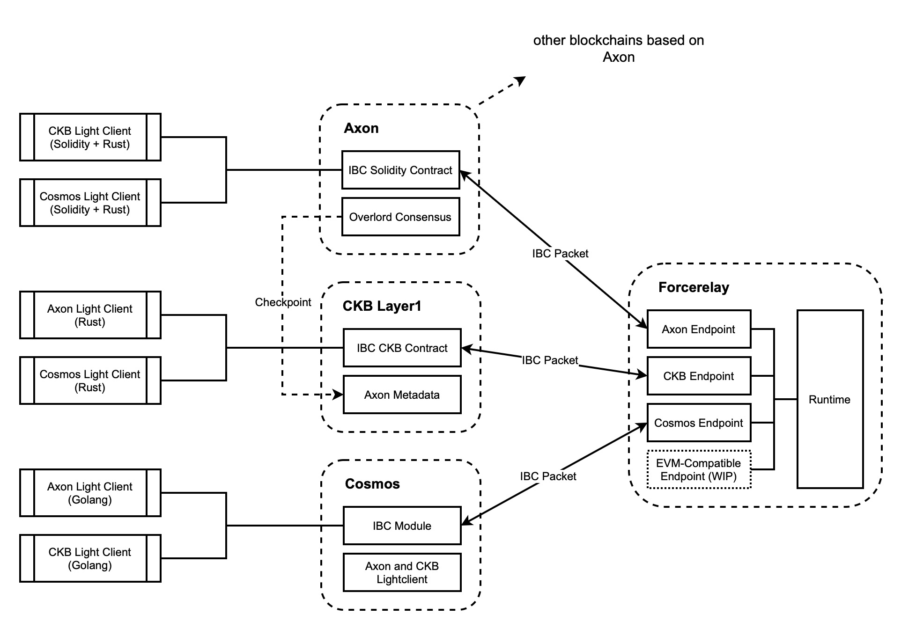

# Forcerelay

[](LICENSE)


Forcerelay is an IBC-Compatible bridge that aims to open up the Nervos ecosystem and the Cosmos ecosystem, and it also serves as a standard cross-chain solution within the Nervos ecosystem.

Forcerelay is built on [Hermes](https://github.com/informalsystems/hermes), this means we will keep continue to track and update the latest version of Hermes, and won't stop it on any specific old version.

Currently, Forcerelay only supports Axon, CKB and Cosmos-SDK chains, but not support other mainstream EVM chains, like Ethereum, Arbitrum and BSC, because it's not easy to run a light-client from any chains above on EVM. However, the implementation of mainstream EVM chains is on our future plan, we will keep you up-to-date with this.

## Progress Tracking
Forcerelay is in development, any issues and PRs are welcome. Here is where we are in gerneral:
- [ ] Upgrade the underline Hermes from v1.4.0 to the latest v1.6.0
- [x] Implement connection and channel layer of IBC protocol between Axon and CKB
- [ ] Implement packet layer of IBC protocol between Axon and CKB
- [ ] Implement entire IBC protocol between Axon and Cosmos-SDK chains
- [ ] Implement entire IBC protocol between CKB and Cosmos-SDK chains

## Architecture Design
Cosmos IBC is a cross-chain protocol designed based on light-client technology. In case of homogeneous chains, it's supposed to implement only one light-client module to run the protocol. However, in case of Forcerelay, chains are non-homogeneous, so we have to implement at least three light-client modules to run IBC protocol between Axon, CKB and Cosmos.

Contract development environment is sensitive to the blockchain's VM implementation, which means the different VM implementation requires us to provide different light-client solutions, even the solutions come from the same blockchain.

High level diagram of Forcerelay:


## Usage Guidance
Take the IBC cross-chain betwwen Axon and CKB as an example.

### Contract Deployment on Axon
Before deploying [ibc-solidity-contract](https://github.com/synapseweb3/ibc-solidity-contract) on Axon, please make sure Node.js and Yarn are installed:

```
$ git clone https://github.com/synapseweb3/ibc-solidity-contract
$ cd ibc-solidity-contract
$ echo AXON_HTTP_RPC_URL="YOUR_AXON_URL" > .env
$ yarn migrate > migrate.log | tail -f migrate.log
```

After running `yarn migrate`, the `OwnableIBCHandler` address is listing in console, we record it and mark as **`YOUR_IBC_AXON_ADDRESS`** to use later.

### Contract Deployment on CKB
Detailed deployment steps can be found in [ibc-ckb-contracts](https://github.com/synapseweb3/ibc-ckb-contracts), or pre-deployed contracts `TYPE_ARGS` on testnet and mainnet can be found here:
||Mainnet|Testnet|
|-|-|-|
|connection|WIP|WIP|
|channel|WIP|WIP|
|packet|WIP|WIP|
|utility|WIP|WIP|
|escrow|WIP|WIP|

### Register Business Module
When deploying the solidity contract on Axon, an initial ICS20 transfer module has been registered in `OwnableIBCHandler` on port `port-0` while contract migration, and it's open to everyone to register their own business module, [here](https://github.com/synapseweb3/ibc-solidity-contract) is the detailed registry steps.

Unlike Axon, modules cannot be registered directly in contract on CKB. To fix that, we introduce [forcerelay-ckb-sdk](https://github.com/synapseweb3/forcerelay-ckb-sdk), which is designed to complete the distribution and calling of custom modules.

Which needs to be noticed is, IBC port on CKB currently is the `LOCK_HASH` of your wallet cell on CKB, we mark it as `WALLET_LOCK_HASH` and use later.

### Installation and Settings
We recommand you to download the pre-compiled binary, or you can compile mannully from the source code, which requires `Rust ^v1.56.0` installed:

```
$ git clone https://github.com/synapseweb3/forcerelay
$ cd forcerelay
$ cargo install -p ibc-relayer-cli
$ forcerelay --version
```

Forcerelay can run by specifying a configuration file in the command line, or the `~/.hermes/config.toml` file will be accessed. An [example](https://github.com/synapseweb3/forcerelay/blob/main/config.toml) configuration file written for Axon and CKB (Testnet) have been pre-generated, and only minimal modifications are required to support running Forcerelay:

```
websocket_addr = "ws://<YOUR_AXON_URL>:<WS_PORT>"
rpc_addr = "http://<YOUR_AXON_URL>:<HTTP_PORT>/"
contract_address = "<YOUR_IBC_AXON_ADDRESS>"
```

### Import Secret Key
Before running Forcerelay, accounts at both sides of blockchains should be prepared and imported. In the scenario of Axon and CKB, Forcerelay needs its own Axon and CKB accounts with sufficient tokens. Here are steps to import Secp256k1 secret keys:

```
$ forcerelay keys add --chain axon-0 --secret-file <SECRET_KEY_PATH>
$ forcerelay keys add --chain ckb4ibc-0 --secret-file <SECRET_KEY_PATH>
```

### Connecting and Start Forcerelay
Establishing IBC channels on both sides of Axon and CKB is required to run Forcerelay:

```
$ forcerelay create channel \
    --a-chain axon-0 --b-chain ckb4ibc-0 \
    --a-port  port-0 --b-port <WALLET_LOCK_HASH> \
    --new-client-connection
$ forcerelay start --config <YOUR_CONFIG_PATH>
```